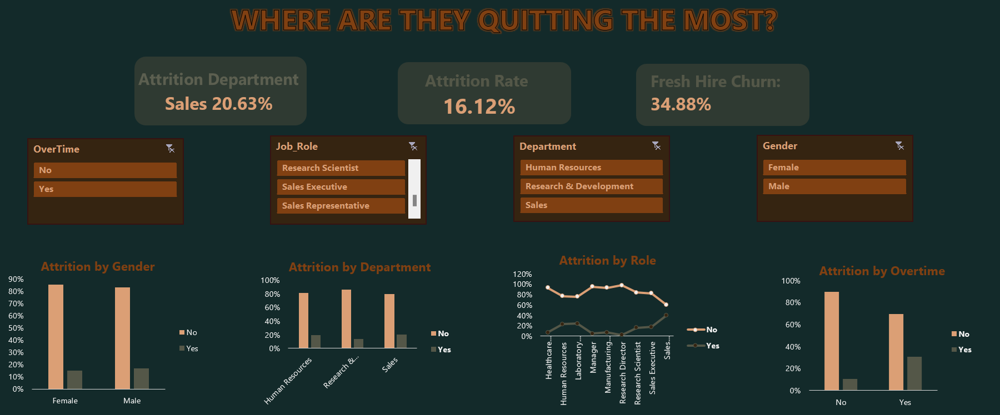

# HR Analytics- The Exit Equation: Understanding Attrition with Excel Dashboard
This project is the first installment in a two-part HR analytics series. While Part 2- *The Loyalty Blueprint* focuses on employee retention, this first phase examines the underlying causes of attrition using descriptive analytics in Excel.

## TL;DR
- **Goal**: Identify patterns and drivers of employee attrition using HR data
- **Tools**: Microsoft Excel (PivotTables, Dashboard Design)
- **Approach**: Segmented employees by department, role, experience, and satisfaction to uncover churn drivers
- **Outcome**: Found key pain points in Sales & Overtime employees and made strategic retention suggestions

## Overview
Utilizing a synthetic HR dataset of 1,470 employees, this analysis identifies key attrition drivers across departments, roles, and demographic groups using Excel-based modeling.

## Key Questions Answered 
 * What are the highest-attrition departments and job roles?
 * Are there demographic or workload patterns linked to exits?
 * How do satisfaction, income, and experience impact turnover?
 * Which employee cohorts are most at risk of leaving?

## Dashboard Preview Section
The dashboard below summarizes key attrition metrics such as department-level churn, job role risks, and satisfaction breakdowns. This was built using Excel, it enables quick diagnosis of high-risk segments.

## KPIs Tracked
 * **Total Attrition Rate**: 16.12%
 * **Fresh Hire Attrition**: 34.88%
 * **Department with Highest Attrition**: Sales (20.63%)
 * **Job Role with Highest Attrition**: Sales Representative (39.76%) 

## Business Insights & Strategic Recommendations
## Departmental Trends
The Sales department had the highest attrition at 20.63%, followed by Human Resources (19.05%).
*Recommendation: Audit job expectations and workload in high-turnover departments to reduce exit risk.*

## Role-Specific Breakdown
Sales Representatives had an attrition rate of 39.76%, nearly 4x the company average. Research Directors had the lowest at 2.5%.
*Insight: Entry-level or quota-driven roles may need better support systems or incentive realignment.*

## Gender-Based Patterns
Male attrition: **17.01%** | Female attrition: **14.80%**
*Tip: Examine role distribution and promotion equity to identify if career pathways differ by gender.*

## Overtime & Burnout
Employees who worked overtime had **30.53%** attrition vs **10.44%** for those who didn't. 
*Action: Monitor overtime trends and introduce burnout prevention strategies in high-pressure roles.*

## Compensation & Retention 
Employees in lower income bands faced **28.61% attrition**.
*Strategy: Strengthen pay transparency and progression frameworks to retain lower-band talent.*

## Tenure & Retention 
Fresh hires (0-1 yrs): **34.88%** attrition vs **12.91%** for 5+ year employees.
*Recommendation: Prioritize onboarding quality and engagement touchpoints in the first 6 months.*

## Satisfaction Metrics
Low scores in **Work-Life Balance (31.25% attrition) and **Job Satisfaction** (22.84%) directly correlated with exits.
*Action: Use pulse surveys to catch early dissatisfaction and implement proactive interventions.*

## Tools Used
* Microsoft Excel
  > Pivot Tables Dashboard Design
* MySQL
  > Though this dashboard was built in Excel, a SQL-based version is included in Part 2 to ensure scalability across tools.

## Folder Structure 

| Folder                    | Description                                  |
|---------------------------|----------------------------------------------|
| `README.me`               | Project documentation and summary            |
| `/data/`                  | Cleaned HR dataset used for analysis         |
| `/image/`                 | Dashboard Preview screenshots                |
| `HR_attrition.xlsx`       | Excel file with complete dashboard           | 
| `Case Study`              | Detailed walkthrough of analysis methodology |

## Case Study: Behind the Queries
[Read the full case study](https://docs.google.com/document/d/1UvtNh63Pqlk9doOYvelR3UggBd_6P2AbMk_uvuq11EQ/edit?usp=sharing)

## What I'd Explore Next
If this were a real consulting engagement:
 * Add *exit interview data* to capture qualitative reasons for leaving
 * Analyze *time-based patterns* in attrition (e.g., seasonality, post-promotion exits)
 * Integrate *employee engagement surveys* to enrich predictive signals

## What This Project Demonstrates
 - My ability to derive strategic insights from operational HR data
 - Skill in building clear, functional dashboards in Excel
 - A strong grasp of business impact behind attrition metrics
 - End-to-end thinking from data cleaning to presentation

## Let's Connect
I'm building tools that uncover workplace dynamics through data. Feel free to reach out via: 
* [GitHub](https://github.com/Shrey0561)
* [LinkedIn](https://www.linkedin.com/in/shreya-srinath-879a66205/)
* [Notion](https://www.notion.so/Data-Analyst-Portfolio-221ebe151fdd801e9445e32590b67758?source=copy_link)

I'm always up for conversations or new opportunities!

